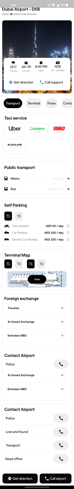

            


                        


A new Flutter project.

## Getting Started

## How To Run
Make sure you have git installed on PC

```bash
git clone https://github.com/Uday-kiran9147/havahavai.git
```
Import dependencies run, Make sure you are in project root directory before running below command.
```bash 
flutter pub get
```
Start application using 
```bash 
flutter run
```
[Design Link](https://marvelapp.com/prototype/1076197/screen/93923389/handoff)
